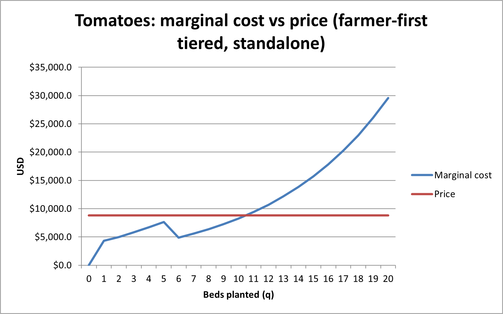
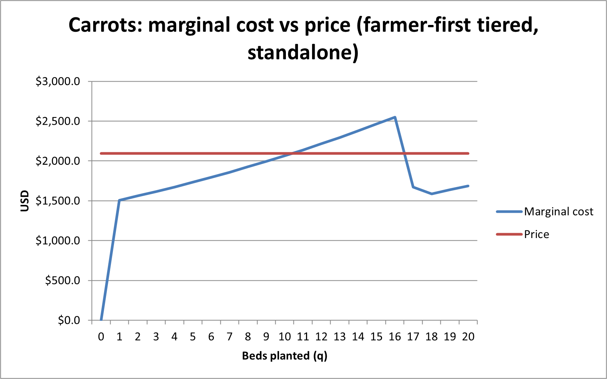
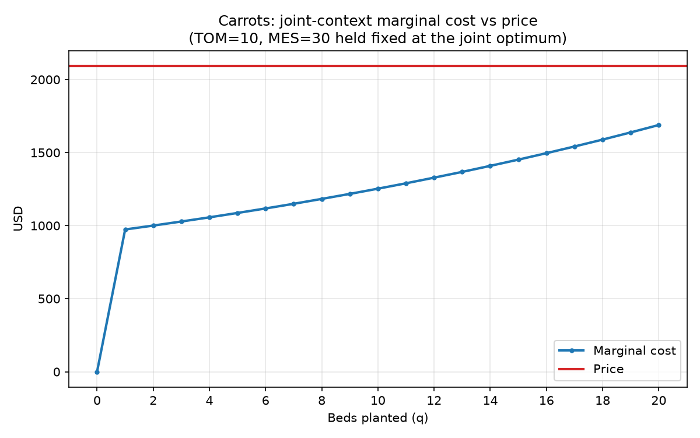
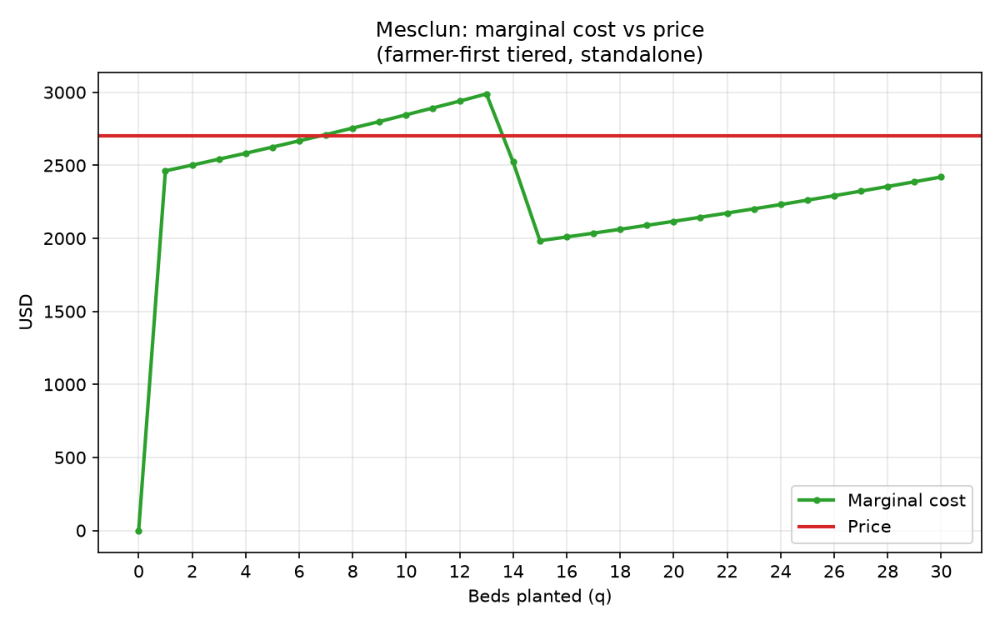

# Perfect Competition Analysis 

### Operational Hypothesis Framework
“20 carrot beds, 30 mesclun beds, and 14 tomato beds to optimize cost and wages.”

### Deep-Dive Executive Analysis & Visual Graph Diagnostics
14 tomato beds is incorrect. At bed 10, the tomato MC remains below the flat $8,800.00 market price, earning a net margin of $551.40. At bed 11, MC rises to $9,390.80, crossing above market price. A notable labor threshold dip between bed 5 and bed 6, occurring when cumulative farm labor crosses 720 hours, drops marginal wage rate from the farmer's implied $34.72/hr to temporary worker’s rate of $17.36/hr. While this wage drop creates a temporary cost reduction, compounding complexity quickly dominates, 10 beds is the strict profit-maximizing cutoff.

*tomato-mc-vs-price.png — the bed 10/11 crossing and the bed 5→6 dip described above.*

20 carrot beds is correct. The standalone chart shows carrot MC crossing above the $2,094.00 market price between beds 10 and 16, before dropping at bed 17. This assumes carrots receive a private allocation of cheap farmer hours.

*carrot-mc-vs-price-standalone.png — MC crosses price between bed 10 and 16, dips again at bed 17.*

In the joint plan, higher-value tomatoes claim cheap farmer hours first, so all carrot expansion is priced at the temporary worker rate ($17.36/hr) from bed 1 onward. Joint carrot MC remains constant at $1,688.80 through bed 20—comfortably below the $2,094.00 price. Carrots generate a shadow price of $352.50 if relaxed to 21 beds.

*carrot-mc-vs-price-joint.png — TOM=10 and MES=30 held at the optimum; MC stays well under price through bed 20.*

30 mesclun beds is correct. Between beds 13 and 15, pooled labor hours pass the 720-hour farmer threshold, causing MC to plummet at bed 15. From bed 15 through bed 30, MC stays well below market price. Mesclun yields a shadow price of $246.50 for the 31st bed.

*mesclun-mc-vs-price.png — the bed 6/7 crossing and the bed 13→15 dip described above.*

### Conclusion & Hypothesis Verdict
While standalone carrots and mesclun operate at net losses, both satisfy the shutdown rule because their market prices exceed Average Variable Cost at their caps—carrots clear $2,094.00 against $1,918.45 AVC, a $175.55 margin per bed toward fixed costs.
In conclusion, expanding tomatoes to 14 beds to force full 64-bed land utilization destroys farm profit. The true profit-maximizing plan is exactly 20 carrots, 30 mesclun, and 10 tomatoes, leaving 4 beds unplanted.

