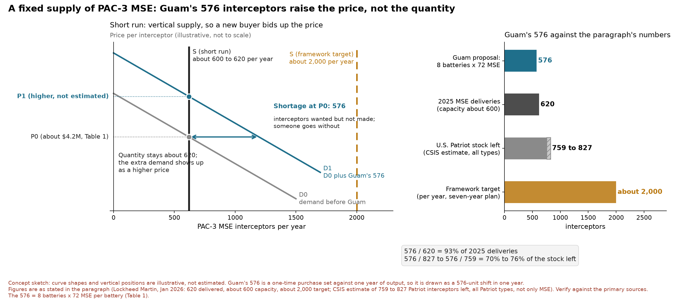

**Introduction**. Guam calls itself "Where America's Day Begins," but if a war with China ever comes, this island may be where it begins too. Beijing’s posture in the Pacific includes plans for Guam. They have paraded their DF-26 ballistic missile, nicknamed the “Guam Express,” and China's air force released a video simulating a bomber strike on a runway that closely resembled Andersen Air Force Base in Guam. America's answer is missile defense, a network of radars and interceptors, built to find and destroy incoming missiles in mid-flight, a feat often compared to hitting a bullet with another bullet. Because a single interceptor can cost anywhere from about $2 million to roughly $30 million, the question is what mix of missile defense capabilities should be bought and employed on Guam.

**Background**. In September 2025, the Department of War approved a roughly $8 billion dollar, 360-degree shield called the Guam Defense System (GDS), and plans to field it in phases, with the first new elements arriving in fiscal year 2027 and the last by fiscal year 2032. GDS is a family of disparate missile systems under one missile defense network executing a layered defense architecture for the island. The House and Senate Appropriations Committees were faced with a framework similar to our cohort’s first micro-economics problem set. Sixteen sites, 3 missile capabilities, and an $8 billion dollar cap. Table 1 introduces each interceptor, what it can stop, and what it costs to field.

<!-- Table 1 image from the .docx: not committed to the repo (no path given), so it is not embedded here -->

**Thesis Statement**. Guam is currently protected by a Navy Aegis Weapon System and an Army Terminal High Altitude Area Air Defense (THAAD) battery. Removing these capabilities and deploying them elsewhere runs into sunk costs. So, the next dollar should be invested in one missile system with interceptors that can get the most bang for the buck to defend the island. The Department of War wants to deploy an undecided amount of Patriot Missile Systems with an undisclosed number of PAC-3 Missile Segment Enhanced (MSE) interceptors. I suggest a total of 8 Patriot Missile Systems with 576 MSE PAC-3 missiles to adequately achieve holistic island defense for Guam. This would cost the nearly $7.7 billion of the $8 billion allocated for GDS. Unlike the cohort’s bed-farm model, this research discovers that the micro-economic implications of a missile system-sites model on Guam have macroeconomic consequences that affect other countries who rely on the Patriot Missile System for defense.

**A Fixed Supply**. The 2026 war with Iran consumed nearly two-thirds of the U.S. Patriot inventory. Analysts at the Center for Strategic and International Studies estimate that only 759 to 827 Patriot interceptors remain, which is about a third of the pre-war stock.\[2\] Every PAC-3 MSE interceptor comes off the same production line. In 2025, Lockheed Martin delivered 620 PAC-3 MSE interceptors while working at a capacity of roughly 600 per year. Only in January 2026 did the Department of War sign a seven-year framework to raise that capacity to about 2,000 per year.\[1\] Measured against those numbers, Guam's proposed 576 MSE interceptors equal 93 percent of an entire year of 2025 production and 70 to 76 percent of what the United States has left. In the short run, interceptor supply behaves like a nearly vertical supply curve. Factories cannot add production lines overnight, so a new buyer cannot call more missiles into existence; it can only raise their price.

**Crowding Out Allies**. When output is fixed, every interceptor the U.S. government buys for Guam is one that cannot go to an ally. Taiwan plans to spend about US$636.9 million on 102 PAC-3 MSE interceptors, and its officials warned in March 2026 that U.S. restocking after the Middle East conflict could delay delivery.\[3\] Guam's order alone is more than five and a half times Taiwan's. In Ukraine, some Patriot crews had exhausted their interceptor stocks by August 2026, and the country cannot manufacture PAC-3s at the scale it needs.\[4\] U.S. forces and Gulf partners in the Middle East are drawing on the same depleted stockpile.\[5\] The opportunity cost of a PAC-3 parked on Guam is not measured only in dollars; it is a PAC-3 that is not defending Kyiv or Taipei. Taiwan sits on the front line of the same Chinese missile threat Guam is preparing for, so a Guam-first allocation that delays Taiwan's defenses may weaken the very deterrence Guam depends on.

**Trade Effects**. Trade ties the Guam decision to the wider economy as well. Patriot sales to allies are U.S. exports, and diverting output to Guam lowers those exports while pushing allies toward substitutes such as NASAMS and IRIS-T, which can handle less demanding threats but cannot fully replace Patriot against ballistic missiles.\[9\] Allied production offers a way out grounded in comparative advantage. Japan, which builds PAC-3 missiles under license, completed its first export of those missiles to the United States in 2025 to replenish stocks drained by aid to Ukraine.\[10\] Expanding co-production adds to global supply instead of dividing a fixed pie. Yet, the production side carries risk too. In December 2024, China banned exports of gallium, germanium, and antimony to the United States, citing their military uses.\[11\] A missile defense built around a single interceptor concentrates that supply-chain exposure in one product line.

**Recommendation**. The House and Senate appropriations committees should use their current Guam Defense System fielding schedule to back-load Guam's PAC-3 MSE purchases into FY2029 through FY2032, when the seven-year production ramp is moving toward 2,000 interceptors per year, rather than compete with Taiwan and Ukraine for today's roughly 600.\[13\] I recommend part of the funding should go to Lockheed Martin’s production capacity itself, which shifts the supply curve outward instead of simply bidding up the price. With a fixed supply, putting Guam first does not create more interceptors, it raises the price for every buyer and weakens the partners whose resistance helps deter China in the first place. Phasing the purchase still delivers Guam's 576 interceptors by 2032, with less pressure on price and less damage to the allies the United States is counting on.
